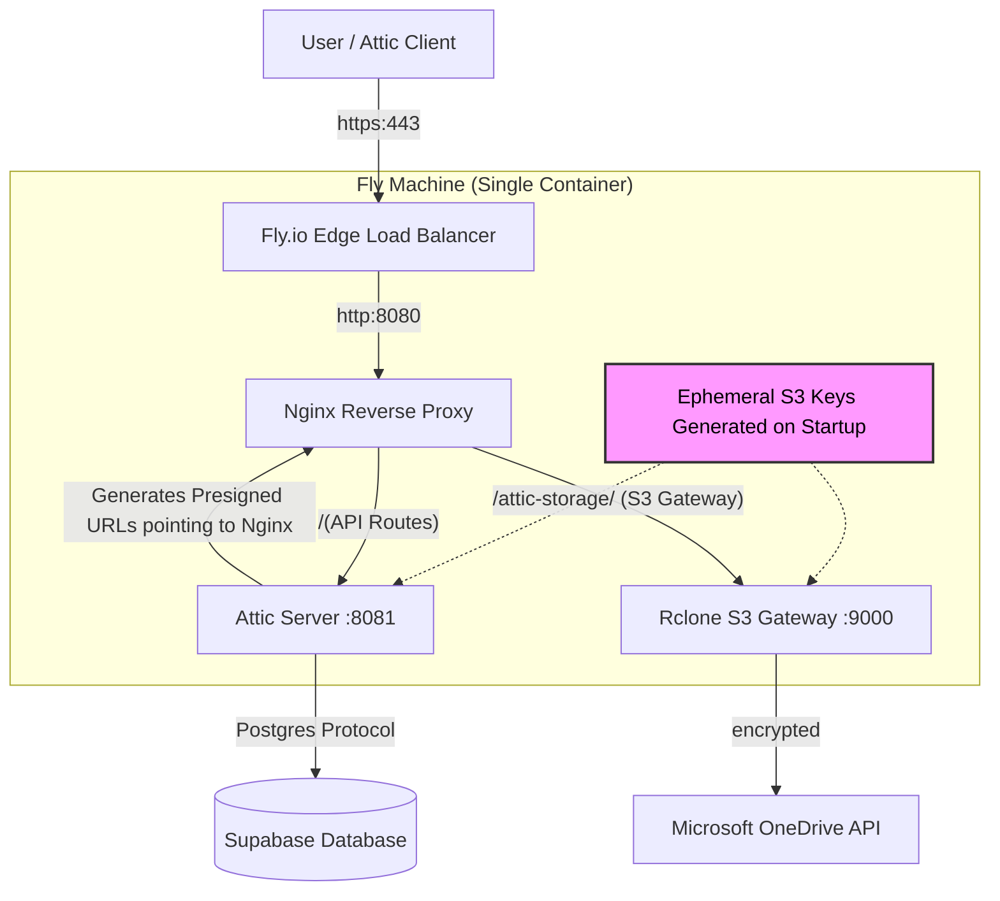
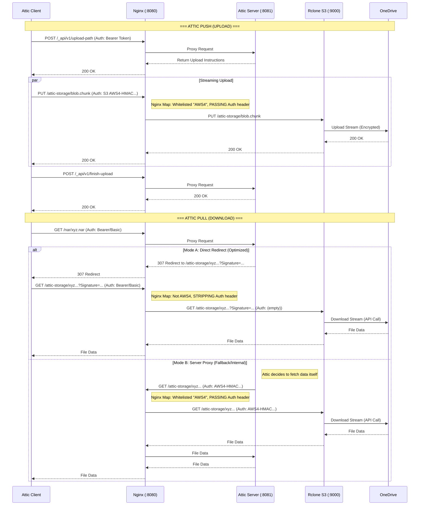

# Attic Server on Fly.io with Rclone (OneDrive) & Supabase

This project deploys an [Attic](https://github.com/zhaofengli/attic) binary cache server on **Fly.io**. It is designed to be a highly cost-effective solution for personal Nix caching by leveraging the free/low-cost tiers of multiple cloud providers:

- **Compute**: Fly.io Micro VM (running a single container).
- **Storage**: Microsoft OneDrive (via Rclone acting as an S3 gateway).
- **Database**: PostgreSQL hosted on **Supabase**.

## Architecture Overview

The system packages multiple processes into a single, minimal Nix-built container (`dockerTools.buildLayeredImage`). Nginx acts as the central process manager and reverse proxy, routing internal traffic between the Attic application server and the Rclone storage gateway.

A key feature of this setup is the automatic handling of S3 credentials. On container startup, an entrypoint script generates ephemeral S3 access and secret keys. These keys are passed to Rclone to secure its local S3 gateway interface, and Attic is configured to use them.

### Components

1. **Fly Edge (External):** Handles public TLS termination (Port 443) and forwards plain HTTP traffic to the container's port 8080.
2. **Nginx (Port 8080 - Internal):** The main entrypoint inside the container. It routes traffic based on URL paths and performs critical HTTP header manipulations to satisfy different authentication requirements for uploads versus downloads.
3. **Attic Server (Port 8081 - Internal):** The core Attic application.
   - **Configuration**: The `attic-config.nix` used here is modified from the official [config-template.toml](https://github.com/zhaofengli/attic/blob/main/server/src/config-template.toml).
   - **Database**: It connects to an external **Supabase PostgreSQL** instance via the `ATTIC_SERVER_DATABASE_URL` environment variable.
4. **Rclone (Port 9000 - Internal):** Runs in `serve s3` gateway mode. It translates S3 API calls into Microsoft OneDrive API calls. It is secured by the ephemeral credentials generated on startup.

### Architecture Diagram



---

## Request Flow & The Authentication Solution

The most complex aspect of this setup is handling the conflicting authentication mechanisms required for S3 access when using the Attic Client through a proxy.

**The Conflict:**

1. **User Downloads:** The Attic Client sends an `Authorization` header (usually `Bearer <token>` or `Basic <token>`) on almost all requests. When it follows a redirect to the S3 gateway (Rclone), it _keeps_ this header. Rclone receives both the S3 Presigned URL (query params) AND the client's Auth token, causing a conflict (Error: `UnsupportedAlgorithm` or `SignatureDoesNotMatch`).
2. **Server Internal Fetches:** The Attic Server sometimes fetches data from S3 directly (acting as a proxy). In this case, it sends a valid `Authorization: AWS4-HMAC...` header, which _must_ be preserved.

**The Solution (Nginx Map):**
We use Nginx to inspect the `Authorization` header content dynamically using a **Whitelist Strategy**:

- **Pass `AWS` Signatures:** If the header starts with `AWS4-HMAC-SHA256` (used by the Attic Server internally or for uploads), Nginx passes it through to Rclone.
- **Strip Everything Else:** If the header is anything else (e.g., `Bearer`, `Basic`), Nginx removes it. This forces Rclone to ignore the client's invalid header and authenticate solely via the valid Presigned URL query parameters.

### Sequence Diagram: Push and Pull Operations



## Deployment & Configuration

### 1. Update Domain Name

Before deploying, ensure you update `attic-config.nix` and `fly.toml` with your actual Fly.io app name.

### 2. Set Secrets

This flake expects configuration to be passed via environment variables. Use `fly secrets set` to configure them safely.

#### Attic Configuration

- `ATTIC_SERVER_DATABASE_URL`: Connection string for the Supabase PostgreSQL database.
- `ATTIC_SERVER_TOKEN_RS256_SECRET_BASE64` (or HS256): The Base64 encoded secret key used for signing Attic authentication tokens.

#### Rclone Configuration

Rclone is configured entirely via environment variables. Since the internal remote name is hardcoded as `remote`, you must use the prefix `RCLONE_CONFIG_REMOTE_` followed by the config option (case-insensitive).

Common variables include:

- `RCLONE_CONFIG_REMOTE_TYPE` (e.g., `onedrive`)
- `RCLONE_CONFIG_REMOTE_TOKEN` (The JSON token blob)
- `RCLONE_CONFIG_REMOTE_DRIVE_ID`
- `RCLONE_CONFIG_REMOTE_CLIENT_ID` / `_SECRET`

For a full list of how to convert `rclone.conf` options to environment variables, see the [Rclone Documentation: Config File](https://rclone.org/docs/#config-file).

**Example Command:**

```bash
fly secrets set \
  ATTIC_SERVER_DATABASE_URL="postgres://..." \
  ATTIC_SERVER_TOKEN_RS256_SECRET_BASE64="..." \
  RCLONE_CONFIG_REMOTE_TYPE="onedrive" \
  RCLONE_CONFIG_REMOTE_TOKEN='{"access_token":"..."}'
```

## Administration (SSH Console)

Since the container runs multiple processes, you can use Fly.io's SSH console to access the running machine for administrative tasks, such as creating users or running garbage collection.

1. **Connect to the container:**

```bash
fly ssh console
```

2. **Run administrative commands:**
   The `atticd` binary is available in the path.

- **Garbage Collection:**

```bash
atticd -f /nix/store/...-attic.toml --mode garbage-collector-once
```

- **Generate a new token:**

```bash
atticadm -f /nix/store/...-attic.toml make-token --sub "alice" --validity "2y" --pull "*" --push "*"
```

## License

[DO WHAT THE FUCK YOU WANT TO PUBLIC LICENSE](https://www.wtfpl.net/)
